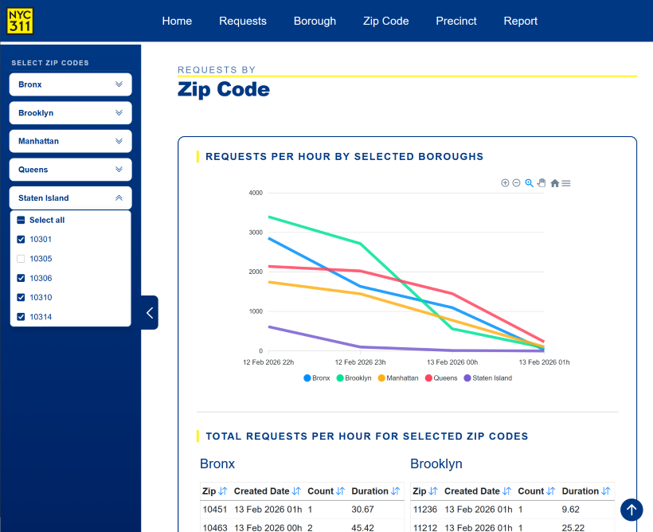

# NYC 311 Dashboard

An interactive dashboard for exploring New York City 311 service request data by borough, precinct, and zip code. Built with Blazor WebAssembly and hosted statically on GitHub Pages — no server required.

## Live Demo
[View the dashboard](https://christopherdgibson.github.io/nyc-311-dashboard)

## What it does
- Filter service requests by borough, precinct, and zip code
- All charts and tables update live on every selection change
- Export the current view to PDF
- Fully responsive — navbar, sidebar, and charts adapt to any screen width

## Tech stack
- C# / Blazor WebAssembly
- ApexCharts (via typed C# interop layer)
- NYC Open Data API
- html2pdf
- GitHub Pages (static hosting)

## Architecture
Pages interact only with three services — `RequestService` for data, `ChartService` for visuals, and `LayoutService` for layout. JS interop is isolated to `LayoutService`. All components are custom-built and fully encapsulated.

## Running locally
```bash
git clone https://github.com/christopherdgibson/nyc-311-dashboard.git
cd nyc-311-dashboard
dotnet run
```
Then navigate to `https://localhost:[port]`

## Screenshot
